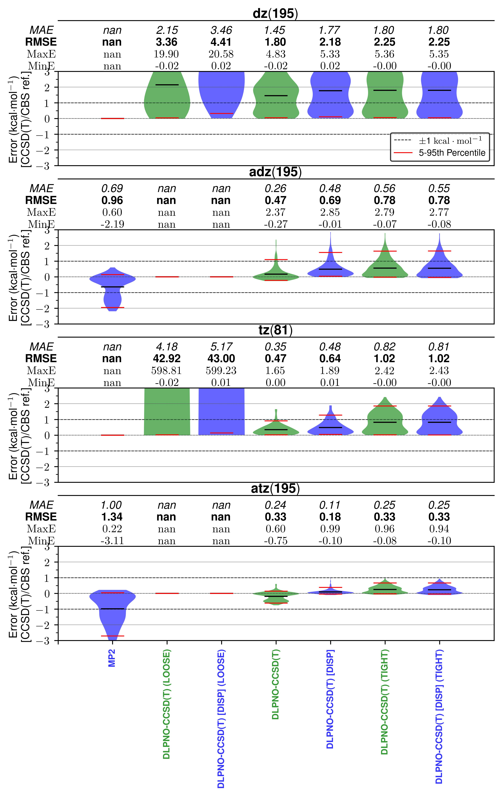

# DLPNO Testing
- ORCA vs. Psi4 against S22
- Psi4 on NBC10 for dispersion correction

## NBC10 Dispersion Corrections

DLPNO-CCSD(T) with aDZ and aTZ are run on NBC10 using hrcl\_jobs and qm_db. Error statistics
against CCSD(T)/CBS are shown in plot below where DLPNO-CCSD(T)/aTZ with normal PNO_CONVERGENCE
performs similarly to TIGHT PNO_CONVERGENCE (at reduced costs).

# Systems
- add a few larger systems (Jaden), check Ka Un Lao for recent benchmarks
- Dr. Poole for conformations of tri-peptides (classical conformational energy
    test sets by Head Gordon)
- 

### Objectives - Dispersion correction

- [x] DLPNO-CCSD(T)/aug-cc-pVDZ \[PNO=Normal] on NBC10 
- [x] DLPNO-CCSD(T)/aug-cc-pVTZ \[PNO=Tight]  on NBC10 
- [x] DLPNO-CCSD(T)/aug-cc-pVTZ \[PNO=Normal] on NBC10 
- [x] DLPNO-CCSD(T)/aug-cc-pVTZ \[PNO=Tight]  on NBC10 
#### PNO Extrapolations - Comps on Hive
- [ ] DLPNO-CCSD(T)/cc-pVDZ \[PNO=Loose]  on NBC10 
- [ ] DLPNO-CCSD(T)/cc-pVTZ \[PNO=Loose]  on NBC10 
- [ ] DLPNO-CCSD(T)/cc-pVQZ \[PNO=Loose]  on NBC10 
- [ ] DLPNO-CCSD(T)/cc-pVDZ \[PNO=Normal]  on NBC10 
- [ ] DLPNO-CCSD(T)/cc-pVTZ \[PNO=Normal]  on NBC10 
- [ ] DLPNO-CCSD(T)/cc-pVQZ \[PNO=Normal]  on NBC10 
- [ ] DLPNO-CCSD(T)/cc-pVDZ \[PNO=Tight]  on NBC10 
- [ ] DLPNO-CCSD(T)/cc-pVTZ \[PNO=Tight]  on NBC10 
- [ ] DLPNO-CCSD(T)/cc-pVQZ \[PNO=Tight]  on NBC10 
- [ ] run DLPNO-CCSD(T)/CBS:
  - does that mean...
    1.  "MP2/aug-cc-pV[T,Q]Z + D:DLPNO-CCSD(T)/aug-cc-pvdz" (subtract of MP2/aug-cc-pvdz)

# DLPNO-CCSD Interaction Energy Notes
## PNO Extrapolations
[Neese extrapolation PNO paper](https://pubs.acs.org/doi/10.1021/acs.jctc.0c00344) 
DLPNO-CCSD(T) energies in Figure 4 in section 3.2. Seems like the Extr.(6/7)
meaning $T_{cutPNO} = 10^{-6}$ and $T_{cutPNO} = 10^{-7}$ is the best with only a little
improvement from aDZ to aQZ. 

[A recent Herbert paper (2024)](https://pubs.aip.org/aip/jcp/article/161/5/054114/3306675)
investigates this Neese extrapolation and other DLPNO thresholds further on
much larger systems (S12L, L7, PAHs, and graphanes) along with S66. They show
that PNO extrapolation seems pretty great for MP2 for over 100 atom systems
that are van der Waals complexes. Definitively state must use CP for IEs for
DLPNO (agrees with what we believed). Loose/normal (5/6) extrapolations are
good except for $\pi$-stacking interactions where normal/tight (6/7) is needed.
DLPNO-CCSD(T) has large 2-6kcal/mol errors for $\pi$-stacking interactions with
"tight" PNO. Seems like DLPNO-MP2 for larger systems is a better than
DLPNO-CCSD(T) if comparing to purely canonical method comparisons. 

They also noted that the canonical extrapolation is bad with augmented basis
sets because diffuse basis functions can lead to large errors as a function of
$T_{cutPNO}$.

## DLPNO-CCSD(T) Basis Set and System Size
[compared CCSD(T) and TightPNO](https://pubs.acs.org/doi/full/10.1021/acs.jpca.0c11270)
[Jan Martin DLPNO Comparison](https://pubs.acs.org/doi/full/10.1021/acs.jctc.0c01106)

